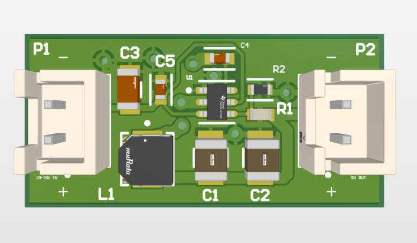
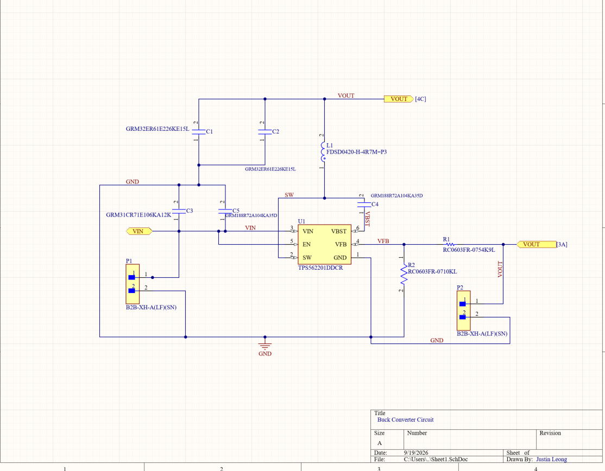
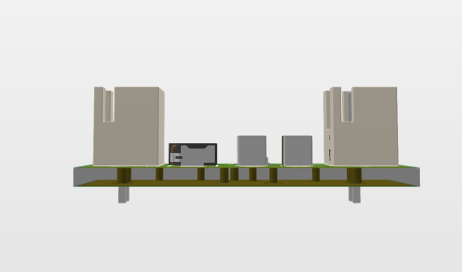
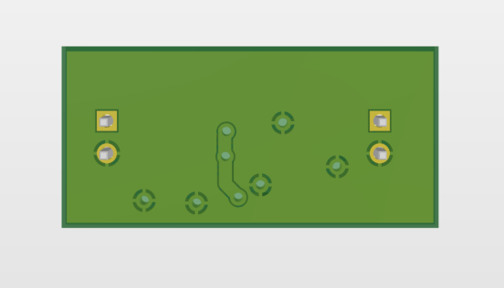

# Step-Down Voltage Regulator

A 2-layer buck converter PCB that takes 10 to 15V in and puts out 5V at up to 2A. I designed it in Altium Designer around the TI TPS562201.



## Status

| Stage | Status |
|---|---|
| Schematic | Complete |
| Layout | Complete, DRC passes with 0 violations |
| Fabrication | Not ordered yet |
| Testing | Not tested yet |

## Specifications

| Parameter | Value |
|---|---|
| Input voltage | 10 to 15V |
| Output voltage | 5V (set by R1/R2 feedback divider) |
| Output current | Up to 2A (TPS562201 rating) |
| Switching frequency | 580kHz |
| Regulator | TI TPS562201DDCR, SOT-23-6 |
| Board | 2 layers, 1.6mm thick, 1oz copper |
| Connectors | JST XH, 2-pin, 2.54mm pitch |

## Schematic



R1 (54.9kΩ) and R2 (10kΩ) set the output voltage:

```
VOUT = VFB × (1 + R1 / R2) = 0.768V × (1 + 54.9k / 10k) ≈ 4.98V
```

The EN pin connects to VIN, so the regulator turns on whenever power is applied. C4 acts as the bootstrap capacitor between SW and VBST.

## Bill of Materials

| Designator | Part Number | Description |
|---|---|---|
| U1 | TPS562201DDCR | 2A synchronous buck converter, SOT-23-6 |
| L1 | Murata FDSD0420-H-4R7M | 4.7µH power inductor |
| C1, C2 | Murata GRM32ER61E226KE15L | 22µF 25V X5R, 1210 (output) |
| C3 | Murata GRM31CR71E106KA12K | 10µF 25V X7R, 1206 (input) |
| C4, C5 | Murata GRM188R72A104KA35D | 0.1µF 100V X7R, 0603 (bootstrap, input bypass) |
| R1 | Yageo RC0603FR-0754K9L | 54.9kΩ 1%, 0603 |
| R2 | Yageo RC0603FR-0710KL | 10kΩ 1%, 0603 |
| P1, P2 | JST B2B-XH-A(LF)(SN) | 2-pin connector, through-hole |

## Pinout

| Connector | Pin 1 (+) | Pin 2 (−) |
|---|---|---|
| P1 (input) | VIN, 10 to 15V | GND |
| P2 (output) | VOUT, 5V | GND |

Pin 1 on each connector carries a "+" mark on the silkscreen. Check your cable wiring against it before you apply power. A reversed supply will likely destroy U1.

## Layout





### Trace widths

I sized the power traces for the full 2A output:

| Net | Width | Current |
|---|---|---|
| SW | 1.0mm | 2A (full inductor current) |
| VOUT | 1.0mm | 2A |
| VIN | 0.5mm | About 1.1A at 10V input |
| VFB, VBST, EN | 0.254mm | Signal level |
| GND | Top and bottom copper pours | Return path |

Each power trace narrows to 0.254mm where it meets U1's pins, since the SOT-23 pads sit 0.95mm apart.

### Design choices

- C3 and C5 sit on the VIN/GND side of U1 to keep the input current loop short.
- Ground vias next to each GND pad tie the top and bottom pours together.
- The SW connection to L1 drops to the bottom layer through two 1.0mm vias (0.5mm holes), sized to carry 2A.
- The SW via next to U1 sits clear of the pin 2 pad, so solder can't wick into the hole during assembly.

### Known limitations

- The SW node crosses to the bottom layer. TI's layout guidance recommends keeping SW short and on one layer. Placing L1 and the input capacitors on opposite sides of U1 would remove both vias. I plan to test this in a second revision.
- I haven't measured output ripple, efficiency, or temperature rise yet.

## Files

| File | Contents |
|---|---|
| `PCB_Project_1.PrjPcb` | Altium project |
| `Sheet1.SchDoc` | Schematic |
| `PCB2.PcbDoc` | PCB layout |
| `PCB_Project_1.BomDoc` | Bill of materials |
| `Constraints.xml` | Design rules |
| `Project Outputs for PCB_Project_1/` | Design rule check report |

Open `PCB_Project_1.PrjPcb` in Altium Designer to view or edit the design.

## References

- [TPS562201 datasheet](https://www.ti.com/product/TPS562201)
- [TI application note SLYT614: step-down converter PCB layout](https://www.ti.com/lit/an/slyt614/slyt614.pdf)
- [ROHM: Switching regulator PCB layout guide](https://fscdn.rohm.com/en/products/databook/applinote/ic/power/switching_regulator/converter_pcb_layout_appli-e.pdf)
